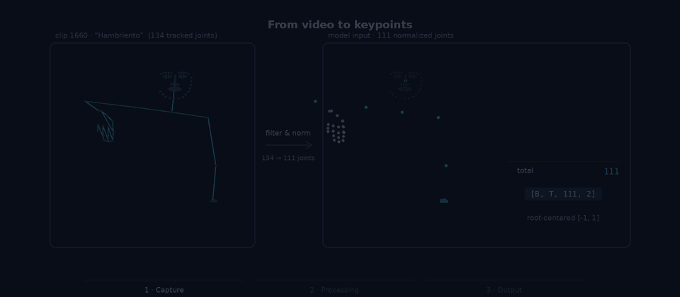

# Multimodal Sign Language Model

Research code for a staged sign-language video-to-text approach. The current Imitator prototype maps keypoint sequences to Gemma token IDs; an optional Gemma stage can correct and format the generated text. This is an experimental research system, not a production translation service.

## How the Imitator works

<p align="center">
  
</p>

**Capture.** A signing clip is reduced to 111 keypoints per frame — 7 pose, 64 face, and 20 per hand — giving a `[B, T, 111, 2]` tensor of `(x, y)` coordinates.

**Processing.** An ST-GCN block mixes information over the skeleton graph and over time, node features are pooled to one vector per frame, and a RoPE Transformer encoder builds frame-level context. A fixed set of 20 learned token queries then cross-attends over those frames, and a final linear projection maps each query into the Gemma embedding space.

**Output.** Taking the argmax over the vocabulary gives one token ID per query, which the Gemma tokenizer decodes into text. A separate, optional pass with a frozen Gemma can correct punctuation and formatting; it is not part of the Imitator forward pass.

The diagram illustrates the design in `src/mslm/models/imitator.py`; current runs go through the v126 temporal trainer (`scripts/train/train_temporal_v126.py`), which wraps that design in single-clip, teacher-forced mode.

The animation is a drawing of the architecture, not a recorded inference. The skeleton, the graph pulses, and the attention weights are procedural, and the keypoints shown are not the clip that produced the transcription. The token IDs and the text in the last scene are a real checkpoint output, but from the teacher-forced evaluation, where the CIF segmentation and the token count are taken from the target; free-running, that run reached 0.369 token top-1 and 7.4% exact sequence match. Regenerate the GIF with `python scripts/docs/make_imitator_animation.py`.

## Repository layout

- `src/mslm/`: models, data loaders, training components, and metrics.
- `scripts/train/`: training entrypoints.
- `scripts/data/`: dataset builders and metadata utilities.
- `scripts/eval/`, `scripts/diagnostics/`, and `scripts/audits/`: evaluation and analysis tools.
- `config/` and `experiments/`: shared settings and versioned experiment configurations.
- `tests/`: unit and script-level tests.

## Requirements

- Python 3.11.11 or newer.
- PyTorch and a compatible CUDA environment are recommended for training.
- Some workflows use Unsloth, Transformers, and Gemma tokenizer/model files.

The repository does not include datasets, pretrained weights, model caches, or generated checkpoints. Obtain these resources from their providers and follow their separate access and license terms. Training workflows require prepared HDF5 data and, for token-prediction runs, a Gemma token embedding table.

## Installation

From the repository root:

```bash
python -m venv .venv
source .venv/bin/activate
python -m pip install --upgrade pip
python -m pip install -e .
```

`pyproject.toml` declares the package dependencies. `requirements.txt` lists a broader environment used by additional training and analysis scripts; PyTorch and CUDA package versions may need to match your hardware.

## Running experiments

Run commands from the repository root. Use `--help` to see each entrypoint's options and provide paths to your prepared data and model files.

```bash
PYTHONPATH=. python scripts/train/train_imitator_dataset1_tokens.py --help
PYTHONPATH=. python scripts/train/train_temporal_v126.py --help
PYTHONPATH=. python scripts/train/train_isolated_staged.py --help
```

For example, to select the versioned v121 isolated-classification configuration:

```bash
PYTHONPATH=. python scripts/train/train_isolated_staged.py \
  --config experiments/v121_v124_isolated_staged/cls_v121.toml
```

To select a CTC configuration:

```bash
MSLM_EXPERIMENT_CONFIG=experiments/v119_ctc/ctc_v119.toml \
  PYTHONPATH=. python scripts/train/train_ctc_v119.py
```

The Imitator entrypoint wraps the temporal trainer in single-clip, teacher-forced mode and writes token prediction records. Provide the HDF5 dataset, tokenizer, and embedding-table paths using its command-line options. All generated outputs should remain outside version control.

## Tests

Install `pytest` in the active environment and run the suite from the repository root:

```bash
python -m pytest tests/
```

## License

Copyright (c) 2026 Christian Velasquez, Giorgio Mancusi, and Rody Vilchez.

Unless otherwise noted, project code and materials are licensed under [CC BY-SA 4.0](https://creativecommons.org/licenses/by-sa/4.0/); see [LICENSE](LICENSE). Third-party software, datasets, and pretrained models retain their own terms.
